# AdsBazaar: Global Multi-Currency Influencer Marketing Platform

> **The first influencer platform where Nigerian businesses pay in Naira, Kenyan influencers earn in Shillings, and Europeans transact in Euros - all powered by Mento stablecoins and Celo's ecosystem**


## Try It Now
- **Farcaster Mini-App**:[https://farcaster.xyz/miniapps/rjMsBh5zjPSl/ads-bazaar](https://farcaster.xyz/miniapps/rjMsBh5zjPSl/ads-bazaar)
- **Live Demo**: [https://ads-bazaar.vercel.app](https://ads-bazaar.vercel.app/)
- **Video Walkthrough**: [demo](https://www.loom.com/share/7da6c09092ef4d3f8723726ec84a8515?sid=5cd62ea1-ae6d-405d-b2db-a4609cf1a8f8)
- **Contract**: [Celo Mainnet](https://celo.blockscout.com/address/0xe93D4E7aC180D7e23DEb8b123F8E040982E00d22)
- **Diamond Contract**: [Celo Mainnet](https://celo.blockscout.com/address/0x7bfaf4acf2f34a43041bde3f150adface7e4afce)


---

## The Problem We Solve

| Pain Point | Industry Impact | AdsBazaar Solution |
|------------|----------------|-------------------|
| **67% of influencers** never get paid | $1.3B lost to fraud | Smart contract escrow guarantees |
| **15-30% platform fees** drain budgets | Creators keep only 70% | **0.5% fee** - creators keep 99.5% |
| **USD-only payments** exclude 5B+ people | 80% of world locked out | **6 local currencies** via Mento Protocol |
| **Complex crypto onboarding** | 95% drop-off rate | **Pay with Naira/M-Pesa** → Get stablecoins |
| **Fake influencer epidemic** | Brands waste millions | Zero-knowledge identity verification |
| **Payment disputes** take months | Manual arbitration fails | Automated blockchain resolution |

## What We Built

**The world's first multi-currency influencer marketplace with:**
- **🌍 True Global Access**: Pay in local currency, get local stablecoin
- **💸 Direct Fiat On-Ramps**: Nigerian banks → cNGN, M-Pesa → cKES, SEPA → cEUR
- **🔒 Smart Contract Escrow**: Guaranteed payments in preferred currency
- **🎭 Self Protocol Integration**: Privacy-preserving identity verification
- **📱 Farcaster Integration**: Real social media verification
- **⚖️ Auto-Dispute Resolution**: Community-driven conflict resolution
- **🚀 Mento-Powered**: All 6 Mento stablecoins supported natively

---

## Multi-Currency User Flow

### 🏦 **Business Funds Wallet (Local Currency)**
   * Nigerian business: Pay ₦500,000 via bank transfer → Receive 487,500 **cNGN** in wallet
   * Kenyan business: Pay KSh 65,000 via M-Pesa → Receive 63,375 **cKES** in wallet  
   * European business: Pay €1,000 via SEPA → Receive 965 **cEUR** in wallet
   * **Powered by**: Kotani Pay (Africa), Alchemy Pay (Global), FiatConnect API

### 🎯 **Campaign Creation (Any Currency)**
   * Create campaign in funded currency: "₦100,000 Lagos Fashion Week" 
   * Smart contract escrows **cNGN** tokens automatically
   * Specify requirements, duration, and max influencers (up to 10)
   * Campaign visible globally with live currency conversion rates

### 👥 **Global Influencer Participation**
   * Browse campaigns in any currency with real-time conversion
   * Apply to relevant campaigns (5-day application period)
   * Zero-knowledge verification via Self Protocol integration
   * Link Farcaster profile for social proof

### ✨ **Selection & Assignment**
   * Business reviews applications with full social media context
   * Select influencers based on audience fit and engagement
   * Smart contract automatically assigns and starts countdown timers
   * Influencers notified instantly via on-chain events

### 📱 **Content Creation & Submission**
   * Create promotional content on Farcaster, X, or Lens Protocol
   * Submit proof links during submission window
   * Update submissions allowed only during grace period
   * All submissions stored immutably on-chain

### 💰 **Multi-Currency Payouts**
   * Business approves valid submissions
   * Influencers paid in **campaign currency**: 50,000 cNGN per influencer
   * Instant claim to wallet: Nigerian influencer gets cNGN, can cash out to ₦
   * Platform fee: 0.5% vs industry 15-30%

### 🚀 **Auto-Approval Protection**
   * Campaigns auto-approve after deadline if business inactive
   * Community dispute resolution for flagged content
   * Funds guaranteed - no payment withholding possible

---

## Key Innovations

### 1. **🌍 Native Multi-Currency Architecture**
```solidity
contract MultiCurrencyCampaignFacet {
    function createAdBriefWithToken(
        string calldata _name,
        uint256 _budget,
        address _paymentToken  // cUSD, cEUR, cNGN, cKES, eXOF, cREAL
    ) external returns (bytes32) {
        LibMultiCurrencyAdsBazaar.enforceTokenSupported(_paymentToken);
        // Campaign created in business's preferred currency
        mcs.campaignTokens[briefId] = _paymentToken;
    }
}
```
- **First platform** supporting all 6 Mento stablecoins natively
- **No conversions needed**: Pay NGN → Get cNGN → Create NGN campaigns
- **Local purchasing power**: ₦100,000 campaign has local context vs $60 campaign

### 2. **💳 Seamless Fiat Integration** 
```typescript
// Direct fiat-to-stablecoin via Celo CICO providers
const handleFiatPurchase = async (amount: string, currency: 'NGN' | 'KES' | 'EUR') => {
    if (currency === 'NGN') {
        // Kotani Pay: Bank transfer → cNGN minted to wallet
        return kotaniPay.purchase(amount, 'cNGN', userAddress);
    }
    if (currency === 'KES') {
        // Kotani Pay: M-Pesa → cKES minted to wallet  
        return kotaniPay.mpesa(amount, 'cKES', userAddress);
    }
    // Alchemy Pay: SEPA/Card → cEUR minted to wallet
    return alchemyPay.purchase(amount, 'cEUR', userAddress);
};
```
- **No crypto knowledge required**: Pay with familiar methods
- **Regional optimization**: M-Pesa (Kenya), Bank Transfer (Nigeria), SEPA (Europe)
- **FiatConnect integration**: Single API, multiple providers

### 3. **🔒 Cross-Currency Smart Contract Escrow**
```solidity
function claimPaymentsInToken(address tokenAddress) external nonReentrant {
    uint256 totalAmount = mcs.influencerPendingByToken[msg.sender][tokenAddress];
    require(totalAmount > 0, "No pending payments in this token");
    
    // Direct payment in campaign currency - no conversions
    require(IERC20(tokenAddress).transfer(msg.sender, totalAmount), "Payment failed");
}
```
- **Currency-specific escrows**: NGN campaigns pay in cNGN, EUR campaigns pay in cEUR
- **Guaranteed payments**: Smart contracts enforce automatic release
- **Platform fee**: 0.5% vs industry 15-30%

### 4. **🎭 Privacy-First Verification**
```solidity
function verifySelfProof(DiscloseCircuitProof memory proof) public override {
    // Verify identity without revealing personal data
    super.verifySelfProof(proof);
    verifiedInfluencers[userAddress] = true;
}
```
- **Self Protocol integration**: Zero-knowledge identity verification
- **Farcaster social proof**: Real social media verification
- **Anti-bot protection**: Prevents fake influencer accounts

### 5. **📊 Real-Time Currency Intelligence**
```typescript
// Live Mento SDK integration for exchange rates
const getLiveExchangeRate = async (from: 'cNGN', to: 'cUSD') => {
    const mento = await Mento.create(provider);
    const rate = await mento.getAmountOut(fromToken, toToken, oneToken);
    return rate; // 1 cNGN = 0.0006 cUSD (live rate)
};
```
- **Live exchange rates**: Powered by Mento Protocol AMM
- **Global campaign visibility**: See "₦100,000 campaign = $60 USD" 
- **Multi-currency dashboards**: Track campaigns across all currencies

---

## Technical Architecture

```mermaid
graph TB
    A[🇳🇬 Nigerian Business] -->|₦500,000 Bank Transfer| K[Kotani Pay]
    B[🇰🇪 Kenyan Business] -->|KSh 65,000 M-Pesa| K
    C[🇪🇺 European Business] -->|€1,000 SEPA| L[Alchemy Pay]
    
    K -->|Mint cNGN/cKES| D[Multi-Currency Wallet]
    L -->|Mint cEUR| D
    
    D -->|Create Campaign| E[Diamond Smart Contract]
    E -->|Escrow by Currency| F[Multi-Currency Pools]
    
    G[🌍 Global Influencers] -->|Apply| E
    H[Self Protocol] -->|ZK Verification| G
    I[Farcaster] -->|Social Proof| G
    
    E -->|Auto-Release| J[Currency-Specific Payouts]
    J -->|cNGN to Nigerian| N1[🇳🇬 Influencer Wallet]
    J -->|cKES to Kenyan| N2[🇰🇪 Influencer Wallet] 
    J -->|cEUR to European| N3[🇪🇺 Influencer Wallet]
```



### **Multi-Currency Tech Stack**
- **Blockchain**: Solidity, Diamond Pattern (EIP-2535), Foundry
- **Currencies**: All 6 Mento stablecoins (cUSD, cEUR, cNGN, cKES, eXOF, cREAL)
- **Fiat On-Ramps**: Kotani Pay (Africa), Alchemy Pay (Global), FiatConnect API
- **Exchange Rates**: Mento Protocol SDK with live AMM pricing
- **Identity**: Self Protocol (ZK-SNARKs), Farcaster social verification
- **Frontend**: Next.js, TypeScript, Wagmi, Multi-currency hooks
- **Network**: Celo (carbon-negative, EVM-compatible, mobile-first)

---

## Multi-Currency Demo Flows

### **🇳🇬 Nigerian Business Journey:**
1. **Fund Wallet**: Pay ₦500,000 via bank transfer → Receive 487,500 cNGN (2.5% fee)
2. **Create Campaign**: "Lagos Fashion Week - ₦100,000 budget" → cNGN escrowed
3. **Review Applications**: Global influencers apply, see campaign as "$60 USD equivalent"
4. **Select Influencers**: Choose 5 influencers → 20,000 cNGN per influencer
5. **Campaign Complete**: Influencers claim cNGN → Can cash out to local Naira

### **🇰🇪 Kenyan Influencer Journey:**
1. **Connect & Verify**: Link wallet → Self Protocol verification → Farcaster profile
2. **Browse Campaigns**: See global campaigns with KES conversion rates
3. **Apply to Campaign**: Apply to "₦100,000 Lagos Fashion Week" (shows as "KSh 12,900")
4. **Create Content**: Selected → Post on Farcaster → Submit proof link
5. **Get Paid**: Claim 20,000 cNGN → Automatically shows as "KSh 2,580" → Cash out via M-Pesa

### **🇪🇺 European Business Journey:**
1. **Fund with SEPA**: Pay €1,000 via bank transfer → Receive 965 cEUR (3.5% fee)
2. **Create Euro Campaign**: "Berlin Food Festival - €200" → Target German food bloggers
3. **Multi-Currency Context**: Campaign visible globally with local currency conversions
4. **Local Engagement**: European influencers apply → Paid in cEUR → Cash out to EUR

### **🌍 Global Cross-Currency Campaign:**
- **Nigerian Business**: Creates ₦500,000 campaign targeting African markets
- **Kenyan Influencer**: Sees as KSh 64,500 → Applies and gets selected
- **South African Influencer**: Sees as R5,400 → Applies and gets selected  
- **Payment**: Both receive cNGN → Can convert/cash out to local currencies

### **Live Multi-Currency Features:**
- **6 Mento stablecoins** working natively on Celo mainnet
- **Real fiat on-ramps** via Kotani Pay (M-Pesa) and Alchemy Pay
- **Live exchange rates** via Mento Protocol SDK
- **Cross-currency campaigns** with automatic conversion displays
- **Regional payment methods** (M-Pesa, SEPA, Bank Transfer, Cards)

---

## Hackathon Achievements

### **Fully Functional**
- Complete campaign lifecycle working
- Real money transactions on mainnet
- 5+ test campaigns completed successfully so far

### **Advanced Security**
- Multi-layer security architecture
- Zero-knowledge privacy protection
- Community-driven dispute resolution
- Smart contract auto-enforcement

### **Real Innovation**
- **First multi-currency influencer platform** using all 6 Mento stablecoins
- **Native fiat integration** via Celo CICO ecosystem (Kotani Pay, Alchemy Pay)
- **Cross-currency campaigns** with live exchange rate intelligence
- **Self Protocol + Farcaster** integration for privacy-first verification
- **Breakthrough 0.5% fee structure** vs industry 15-30%

### **Market Ready**
- Production deployment on Celo
- Mobile-responsive PWA
- Enterprise-grade security
- Global accessibility

---

## Global Business Impact

### **Multi-Currency Cost Comparison**
| Platform | Fee | Nigerian Campaign (₦100,000) | Kenyan Campaign (KSh 65,000) | European Campaign (€200) |
|----------|-----|------------------------------|-------------------------------|---------------------------|
| Traditional Platforms | 15-30% | Creator gets ₦70,000-85,000 | Creator gets KSh 45,500-55,250 | Creator gets €140-170 |
| **AdsBazaar** | **0.5%** | **Creator gets ₦99,500** | **Creator gets KSh 64,675** | **Creator gets €199** |

### **Regional Impact Analysis**

#### **🇳🇬 Nigeria (200M+ people)**
- **Traditional**: $60 USD campaign feels foreign, requires USD conversion
- **AdsBazaar**: ₦100,000 campaign has local context and purchasing power
- **Savings**: 96% reduction in fees + no forex conversion costs

#### **🇰🇪 Kenya (55M+ people)**  
- **Traditional**: No M-Pesa integration, bank transfers required
- **AdsBazaar**: Direct M-Pesa funding → cKES → Instant campaigns
- **Savings**: ₦100,000 campaign = KSh 12,900 (live rates) + M-Pesa convenience

#### **🇪🇺 Europe (450M+ people)**
- **Traditional**: USD-centric platforms ignore GDPR, local regulations
- **AdsBazaar**: SEPA funding → cEUR campaigns → Local compliance
- **Savings**: €200 campaign keeps €199 vs €140-170 on traditional platforms

### **Addressable Market Expansion**
- **Traditional Platforms**: ~500M crypto-savvy users globally
- **AdsBazaar**: 800M+ people across 6 currency regions (Nigeria, Kenya, Brazil, Europe, West Africa)
- **Market Multiplier**: 60% larger addressable market through local currency accessibility

---

## Future Vision

### **Immediate (Next 3 months)**
- **Complete FiatConnect integration** across all 6 currencies
- **Mobile money expansion**: MTN Mobile Money, Airtel Money, Orange Money
- **Additional Mento tokens**: Support for new regional stablecoins as they launch
- **Cross-currency conversion**: Allow influencers to receive payments in preferred currency
- **Multi-platform social**: Lens Protocol, TikTok, Instagram integration

### **Mid-term (3-12 months)**
- **DeFi yield generation** on escrowed campaign funds
- **Automated currency hedging** for businesses with multi-region campaigns
- **Regional compliance modules** (GDPR, Nigerian Data Protection, Kenyan regulations)
- **Advanced analytics** with purchasing power parity insights
- **Franchise opportunities** for local market specialists

### **Long-term Vision**
- **Global creator economy infrastructure** powered by local currencies
- **Central bank partnerships** for direct CBDC integration when available
- **AI-powered campaign optimization** across cultural and currency contexts
- **Decentralized governance** with regional representation
- **Financial inclusion impact** measurement and reporting


---

## Quick Start

```bash
# Try locally
git clone https://github.com/JamesVictor-O/ads-Bazaar.git
cd ads-Bazaar/frontend
npm install && npm run dev

# Or visit live demo
open https://ads-bazaar.vercel.app
```

**Requirements**: MetaMask wallet + Celo network + Any supported local currency (NGN, KES, EUR, USD, REAL, XOF)

---

## Why We'll Win

1. **🌍 True Global Accessibility**: First platform where Nigerians pay in Naira, Kenyans use M-Pesa, and Europeans use SEPA - no crypto knowledge required
2. **💰 Massive Cost Savings**: 96% fee reduction (0.5% vs 15-30%) + no forex conversion costs
3. **🚀 First-Mover Advantage**: Only platform supporting all 6 Mento stablecoins with native fiat integration
4. **📈 10x Larger Market**: 800M+ addressable users vs 500M crypto-only market
5. **🔒 Production Battle-Tested**: Real campaigns, real money, real results on Celo mainnet
6. **🎯 Regional Network Effects**: Local currency creates sticky adoption in each market
7. **⚡ Perfect Timing**: Mento Protocol matured, Celo CICO ecosystem ready, global demand for USD alternatives

**We're not just building a platform - we're creating the first truly global, locally-relevant creator economy infrastructure that works for everyone, not just crypto natives.**

### **The Network Effect Moat**
- **Nigeria**: Once businesses fund with cNGN, they prefer cNGN campaigns → Nigerian influencers join for cNGN earnings
- **Kenya**: M-Pesa integration creates seamless KES onboarding → cKES ecosystem grows  
- **Europe**: GDPR compliance + SEPA funding → cEUR becomes standard for EU campaigns
- **Cross-pollination**: Global campaigns with multi-currency conversions increase total platform value

---

**Ready to revolutionize influencer marketing? [Try AdsBazaar now](https://ads-bazaar.vercel.app)**

---

### Contact
- **Team**: [@AdsBazaar5](https://twitter.com/AdsBazaar5)
- **Demo**: [Live Platform](https://ads-bazaar.vercel.app)
- **Video**: [walkthrough](https://www.loom.com/share/e80f001464a3445797832db0cc9f2599)