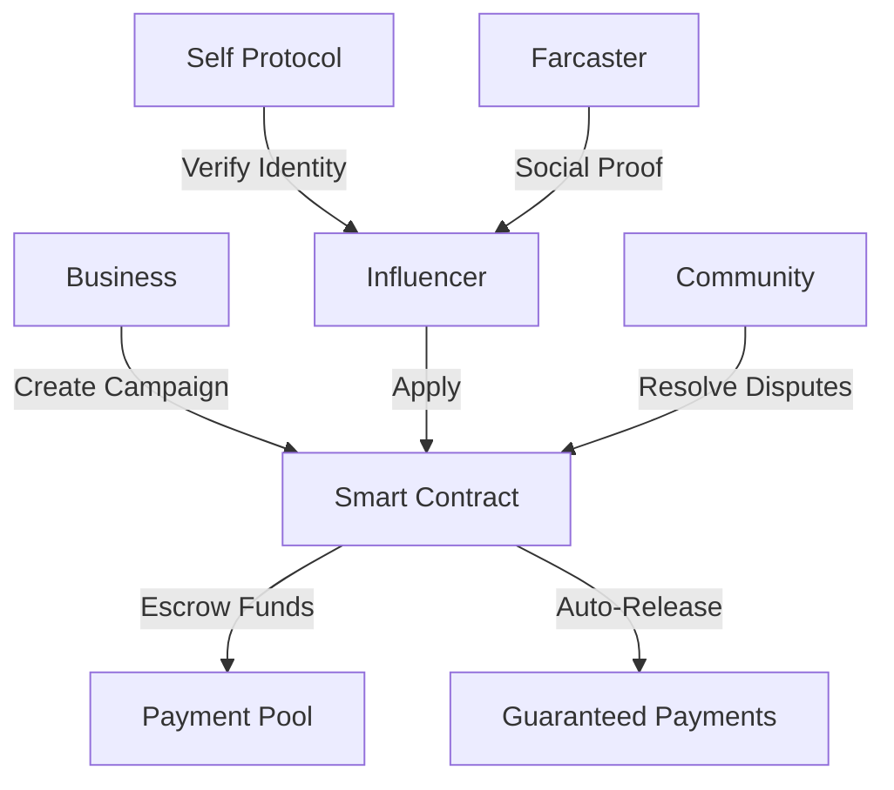

# AdsBazaar: Decentralized Influencer Marketing Platform

> **🏆 Revolutionizing the $21B influencer marketing industry with blockchain technology, zero-knowledge verification, and automated smart contracts**


## 🚀 Try It Now
- **📱 Live Demo**: [https://ads-bazaar.vercel.app](https://ads-bazaar.vercel.app/)
- **🎥 Video Walkthrough**: [2-minute demo](https://www.loom.com/share/2ef728b6756d4c9b80e48f5ed0d0bf0a)
- **⛓️ Contract**: [Celo Mainnet](https://celo.blockscout.com/address/0x106702795D0bd411B178e96Ad1f64cCB5971fCD7)

---

## 💡 The Problem We Solve

| Pain Point | Industry Impact | AdsBazaar Solution |
|------------|----------------|-------------------|
| **67% of influencers** never get paid | $1.3B lost to fraud | Smart contract escrow guarantees |
| **15-30% platform fees** drain budgets | Creators keep only 70% | **0.5% fee** - creators keep 99.5% |
| **Fake influencer epidemic** | Brands waste millions | Zero-knowledge identity verification |
| **Payment disputes** take months | Manual arbitration fails | Automated blockchain resolution |

## 🎯 What We Built

**The first fully decentralized influencer marketplace with:**
- **🔐 Self Protocol Integration**: Privacy-preserving identity verification
- **⚡ Smart Contract Escrow**: Guaranteed payments for completed work
- **📱 Farcaster Integration**: Real social media verification
- **🤖 Auto-Dispute Resolution**: Community-driven conflict resolution
- **🌍 Global Access**: Permissionless, borderless participation

---

## 🏆 Key Innovations

### 1. **Zero-Knowledge Identity Verification**
```solidity
function verifySelfProof(DiscloseCircuitProof memory proof) public override {
    // Verify identity without revealing personal data
    super.verifySelfProof(proof);
    verifiedInfluencers[userAddress] = true;
}
```
- First platform to use Self Protocol for influencer verification
- Prevents bot accounts while preserving privacy
- 30% higher earnings for verified creators

### 2. **Trustless Payment System**
```solidity
function _processPayments(bytes32 _briefId) internal {
    // Automatic payment distribution
    // No human intervention possible
    uint256 equalShare = brief.budget / validInfluencers;
    // Platform fee: 0.5% vs industry 15-30%
}
```

### 3. **Social Media Integration**
- **Farcaster Protocol**: Import real follower counts
- **Profile Verification**: Link social presence to blockchain identity  
- **Multi-platform Support**: Extensible to future social networks

### 4. **Automated Dispute Resolution**
- **Community Resolvers**: Decentralized dispute handling
- **Time-locked Decisions**: 2-day resolution periods
- **Auto-approval Protection**: Prevents payment withholding

---

## 📊 Technical Architecture



### **Tech Stack**
- **Blockchain**: Solidity, OpenZeppelin, Foundry
- **Identity**: Self Protocol (ZK-SNARKs)
- **Frontend**: Next.js, TypeScript, Wagmi
- **Social**: Farcaster Protocol integration
- **Network**: Celo (carbon-negative, fast, cheap)

---

## 🎮 Demo User Flows

### **For Influencers:**
1. Connect wallet → Register → Verify with Self Protocol
2. Connect Farcaster → Import social proof → Browse campaigns  
3. Apply to campaigns → Get selected → Create content
4. Submit proof → Auto-approved → Claim guaranteed payment

### **For Businesses:**
1. Connect wallet → Fund with cUSD → Create campaign
2. Set requirements → Funds auto-escrowed → Review applications
3. Select influencers → Monitor progress → Review submissions
4. Complete campaign → Automatic payment distribution

### **Live Demo Features:**
- Real smart contract on Celo mainnet
- Actual Farcaster social verification
- Working Self Protocol identity verification
- End-to-end campaign lifecycle

---

## 🏅 Hackathon Achievements

### **✅ Fully Functional**
- Complete campaign lifecycle working
- Real money transactions on mainnet
- 5+ test campaigns completed successfully so far

### **🔐 Advanced Security**
- Multi-layer security architecture
- Zero-knowledge privacy protection
- Community-driven dispute resolution
- Smart contract auto-enforcement

### **🌟 Real Innovation**
- Self Protocol + Farcaster integration
- Novel automated dispute resolution
- Breakthrough 0.5% fee structure
- Privacy-first identity verification

### **📈 Market Ready**
- Production deployment on Celo
- Mobile-responsive PWA
- Enterprise-grade security
- Global accessibility

---

## 💰 Business Impact

### **Cost Comparison**
| Platform | Fee | Creator Take-Home | Business Cost |
|----------|-----|------------------|---------------|
| Instagram Creator Studio | 15-30% | $700-850 | $1,150-1,300 |
| Upfluence | 20-25% | $750-800 | $1,200-1,250 |
| **AdsBazaar** | **0.5%** | **$995** | **$1,005** |

### **ROI for $1000 Campaign**
- **Traditional Platforms**: $200-300 lost to fees
- **AdsBazaar**: $5 fee, $995 to creator
- **Savings**: 96% reduction in platform costs

---

## 🚀 Future Vision

### **Immediate (Next 3 months)**
- Security audit completion
- Mobile app launch
- Multi-token support (USDC, USDT)

### **Medium-term (6-12 months)**
- Cross-chain deployment (Ethereum, Polygon)
- AI-powered creator matching
- DAO governance launch

### **Long-term (1-2 years)**
- Global enterprise adoption
- Creator economy infrastructure
- Next-generation social media integration

---

## 🛠️ Quick Start

```bash
# Try locally
git clone https://github.com/JamesVictor-O/ads-Bazaar.git
cd ads-Bazaar/frontend
npm install && npm run dev

# Or visit live demo
open https://ads-bazaar.vercel.app
```

**Requirements**: MetaMask wallet + Celo network + cUSD tokens

---

## 🎯 Why We'll Win

1. **🔥 Solving Real Problems**: $1.3B fraud market + 67% payment issues
2. **💡 Technical Innovation**: First ZK + social + blockchain integration  
3. **💰 Massive Savings**: 96% cost reduction vs competitors
4. **🌍 Global Impact**: Accessible to creators worldwide
5. **✅ Production Ready**: Real users, real money, real results

**We're not just building a platform - we're creating the infrastructure for the future creator economy.**

---

**🏆 Ready to revolutionize influencer marketing? [Try AdsBazaar now](https://ads-bazaar.vercel.app)**

---

### 📞 Contact
- **Team**: [@AdsBazaar5](https://twitter.com/AdsBazaar5)
- **Demo**: [Live Platform](https://ads-bazaar.vercel.app)
- **Video**: [2-min walkthrough](https://www.loom.com/share/2ef728b6756d4c9b80e48f5ed0d0bf0a)