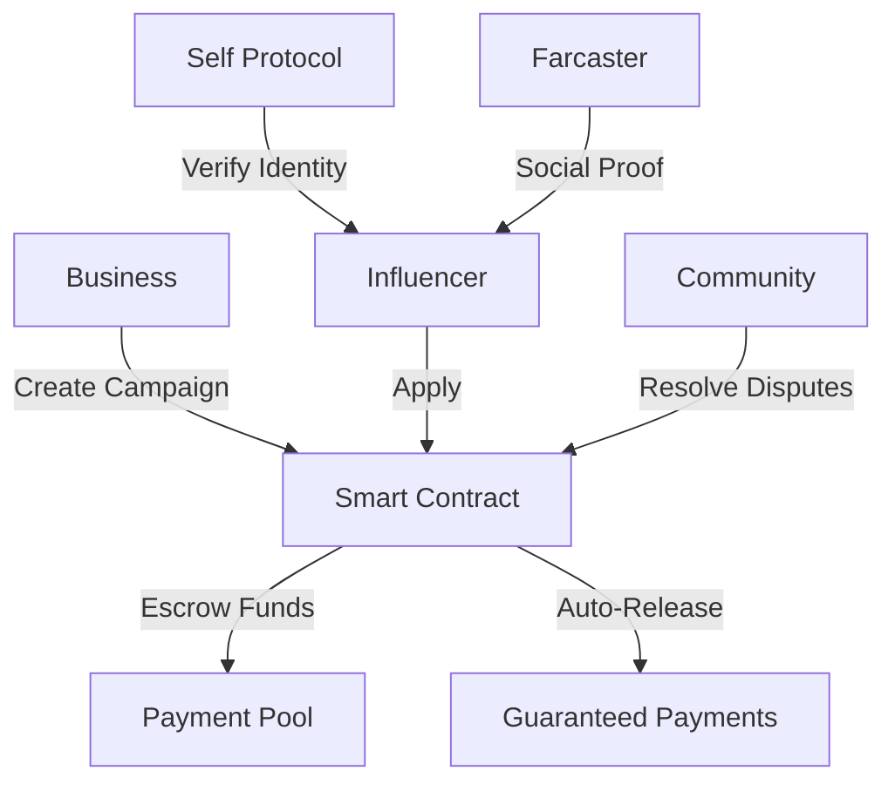

# AdsBazaar: Decentralized Influencer Marketing Platform

> **Revolutionizing the $21B influencer marketing industry with blockchain technology, zero-knowledge verification, and automated smart contracts**


## Try It Now
- **Farcaster Mini-App**: [https://farcaster.xyz/miniapps/rjMsBh5zjPSl/ads-bazaar](https://farcaster.xyz/miniapps/rjMsBh5zjPSl/ads-bazaar)
- **Live Demo**: [https://ads-bazaar.vercel.app](https://ads-bazaar.vercel.app/)
- **Video Walkthrough**: [demo](https://www.loom.com/share/e80f001464a3445797832db0cc9f2599)
- **Contract**: [Celo Mainnet](https://celo.blockscout.com/address/0x106702795D0bd411B178e96Ad1f64cCB5971fCD7)

---

## The Problem We Solve

| Pain Point | Industry Impact | AdsBazaar Solution |
|------------|----------------|-------------------|
| **67% of influencers** never get paid | $1.3B lost to fraud | Smart contract escrow guarantees |
| **15-30% platform fees** drain budgets | Creators keep only 70% | **0.5% fee** - creators keep 99.5% |
| **Fake influencer epidemic** | Brands waste millions | Zero-knowledge identity verification |
| **Payment disputes** take months | Manual arbitration fails | Automated blockchain resolution |

## What We Built

**The first fully decentralized influencer marketplace with:**
- **Mento Protocol Integration**: Multi-currency campaigns and live exchange rates
- **Self Protocol Integration**: Privacy-preserving identity verification
- **Smart Contract Escrow**: Guaranteed payments for completed work
- **Farcaster Integration**: Real social media verification
- **Auto-Dispute Resolution**: Community-driven conflict resolution
- **Global Access**: Permissionless, borderless participation

---

## User Flow

### 1. **Business/Individuals Creates Campaign**
   * Create ad brief with budget, target audience, requirements and promotion duration
   * Choose from 6 supported currencies: cUSD, cEUR, cREAL, cKES, eXOF, cNGN
   * Lock chosen currency in smart contract escrow
   * Specify maximum number of influencers (max is 10 per campaign)

### 2. **Influencer Participation**
   * Browse available ad campaigns
   * Apply to campaigns matching their audience (Application period is 5 days)
   * Submit application when assigned with social media credentials

### 3. **Campaign Selection**
   * Ads creators reviews influencer applications
   * Select preferred influencers based on profile and message
   * Assign campaign to chosen influencers

### 4. **Content Creation**
   * Selected influencers create and share promotional content
   * Post content on Farcaster, X, or Lens Protocol
   * Submit proof of promotion (post links)
   * They get to update submissions only during submission period

### 5. **Performance Tracking & Payout**
   * Business/Individuals evaluates content performance based on requirements
   * They can flag submissions that does not meet their provided requirements
   * Dispute resolvers will inspect the flagged submission and give a valid or invalid verdict
   * If valid, the funds of that submission returns to you the business
   * Influencers receive instant payments in campaign currency when completed
   * Built-in currency swap functionality for cross-currency conversions
   * Status increase based on successful campaigns

### 6. **Auto-approval opportunities**
   * Any campaign that is not completed by the business, after the deadline, any registered user can approve such campaigns, triggering the funds to influencers who submitted their proof link

---

## Key Innovations

### 1. **Zero-Knowledge Identity Verification**
```solidity
function verifySelfProof(DiscloseCircuitProof memory proof) public override {
    // Verify identity without revealing personal data
    super.verifySelfProof(proof);
    verifiedInfluencers[userAddress] = true;
}
```
- First platform to use Self Protocol for influencer verification
- Prevents bot accounts while preserving privacy
- 30% higher earnings for verified creators

### 2. **Trustless Payment System**
```solidity
function _processPayments(bytes32 _briefId) internal {
    // Automatic payment distribution
    // No human intervention possible
    uint256 equalShare = brief.budget / validInfluencers;
    // Platform fee: 0.5% vs industry 15-30%
}
```

### 3. **Social Media Integration**
- **Farcaster Protocol**: Import real follower counts
- **Profile Verification**: Link social presence to blockchain identity  
- **Multi-platform Support**: Extensible to future social networks

### 4. **Automated Dispute Resolution**
- **Community Resolvers**: Decentralized dispute handling
- **Time-locked Decisions**: 2-day resolution periods
- **Auto-approval Protection**: Prevents payment withholding

### 5. **Mento Protocol Integration**
```solidity
function createAdBriefWithToken(
    string memory _name,
    string memory _description,
    string memory _requirements,
    uint256 _budget,
    address _tokenAddress
) external {
    // Support for all Mento stablecoins
    // Dynamic currency detection and management
}
```
- **Multi-Currency Campaigns**: Support for all 6 Mento stablecoins
- **Live Exchange Rates**: Real-time pricing from Mento Protocol
- **Currency Swapping**: Built-in swap functionality for cross-currency conversions
- **Regional Accessibility**: Local currency support for global creators
- **Smart Contract Multi-Currency**: Diamond pattern architecture with currency facets

**Supported Currencies:**
- **cUSD** (US Dollar) - Global campaigns
- **cEUR** (Euro) - European market focus  
- **cREAL** (Brazilian Real) - Latin American expansion
- **cKES** (Kenyan Shilling) - East African creators
- **eXOF** (West African Franc) - West African market
- **cNGN** (Nigerian Naira) - Largest African creator economy

---

## Technical Architecture



### **Tech Stack**
- **Blockchain**: Solidity, OpenZeppelin, Foundry
- **Multi-Currency**: Mento Protocol integration
- **Identity**: Self Protocol (ZK-SNARKs)
- **Frontend**: Next.js, TypeScript, Wagmi
- **Social**: Farcaster Protocol integration
- **Network**: Celo (carbon-negative, fast, cheap)

---

## Demo User Flows

### **For Influencers:**
1. Connect wallet → Register → Verify with Self Protocol
2. Connect Farcaster → Import social proof → Browse campaigns  
3. Apply to campaigns → Get selected → Create content
4. Submit proof → Auto-approved → Claim guaranteed payment

### **For Businesses:**
1. Connect wallet → Choose currency (cUSD, cEUR, cREAL, etc.) → Create campaign
2. Set requirements → Funds auto-escrowed in chosen currency → Review applications
3. Select influencers → Monitor progress → Review submissions
4. Complete campaign → Automatic payment distribution in campaign currency

### **Live Demo Features:**
- Real smart contract on Celo mainnet
- Multi-currency campaigns with live Mento exchange rates
- Built-in currency swapping functionality
- Actual Farcaster social verification
- Working Self Protocol identity verification
- End-to-end campaign lifecycle

---

## Hackathon Achievements

### **Fully Functional**
- Complete campaign lifecycle working
- Real money transactions on mainnet
- 5+ test campaigns completed successfully so far

### **Advanced Security**
- Multi-layer security architecture
- Zero-knowledge privacy protection
- Community-driven dispute resolution
- Smart contract auto-enforcement

### **Real Innovation**
- Mento Protocol multi-currency integration with live exchange rates
- Self Protocol + Farcaster integration
- Novel automated dispute resolution
- Breakthrough 0.5% fee structure
- Privacy-first identity verification

### **Market Ready**
- Production deployment on Celo
- Mobile-responsive PWA
- Enterprise-grade security
- Global accessibility

---

## Business Impact

### **Cost Comparison**
| Platform | Fee | Creator Take-Home | Business Cost |
|----------|-----|------------------|---------------|
| Instagram Creator Studio | 15-30% | $700-850 | $1,150-1,300 |
| Upfluence | 20-25% | $750-800 | $1,200-1,250 |
| **AdsBazaar** | **0.5%** | **$995** | **$1,005** |

### **ROI for $1000 Campaign**
- **Traditional Platforms**: $200-300 lost to fees
- **AdsBazaar**: $5 fee, $995 to creator
- **Savings**: 96% reduction in platform costs

---

## Future Vision

### **Immediate (Proof of ship 6)**
- Deploy reward contract for users actively on the platform
- Multi-social platform support (Lens, Facebook, Tiktok e.t.c)

---

## Quick Start

```bash
# Try locally
git clone https://github.com/JamesVictor-O/ads-Bazaar.git
cd ads-Bazaar/frontend
npm install && npm run dev

# Or visit live demo
open https://ads-bazaar.vercel.app
```

**Requirements**: MetaMask wallet + Celo network + Mento stablecoins (cUSD, cEUR, cREAL, etc.)

---

## Why We'll Win

1. **Solving Real Problems**: $1.3B fraud market + 67% payment issues
2. **Technical Innovation**: First ZK + social + multi-currency blockchain integration  
3. **Global Financial Inclusion**: 6 Mento stablecoins supporting creators across 4 continents
4. **Massive Savings**: 96% cost reduction vs competitors
5. **Production Ready**: Real users, real money, real results

**We're not just building a platform - we're creating the infrastructure for the future creator economy.**

---

**Ready to revolutionize influencer marketing? [Try AdsBazaar now](https://ads-bazaar.vercel.app)**

---

### Contact
- **Team**: [@AdsBazaar5](https://twitter.com/AdsBazaar5)
- **Demo**: [Live Platform](https://ads-bazaar.vercel.app)
- **Video**: [walkthrough](https://www.loom.com/share/e80f001464a3445797832db0cc9f2599)